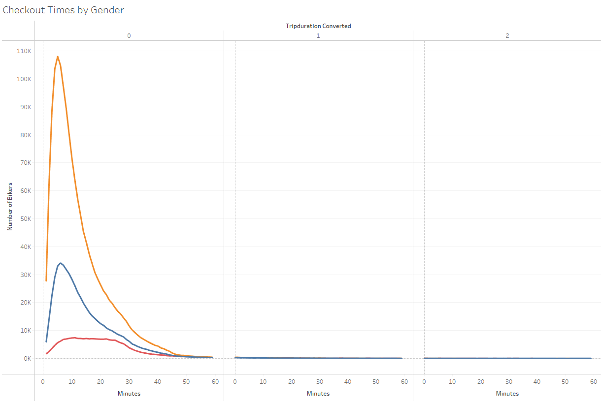
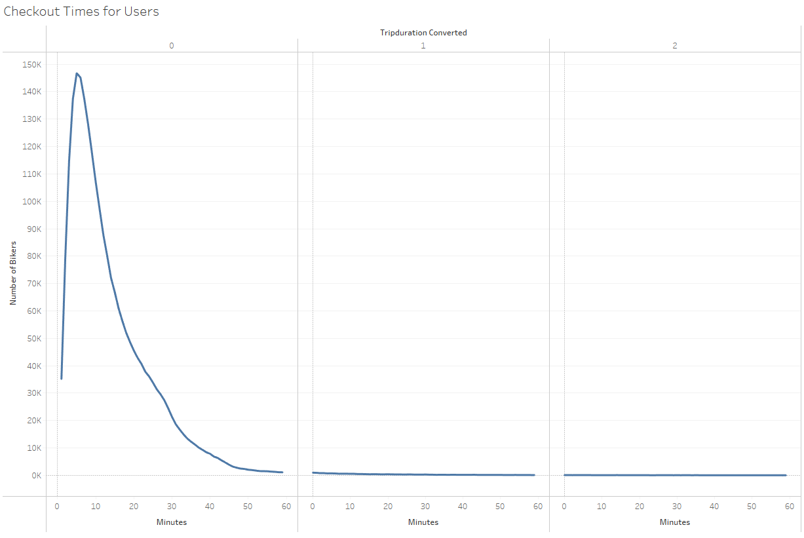
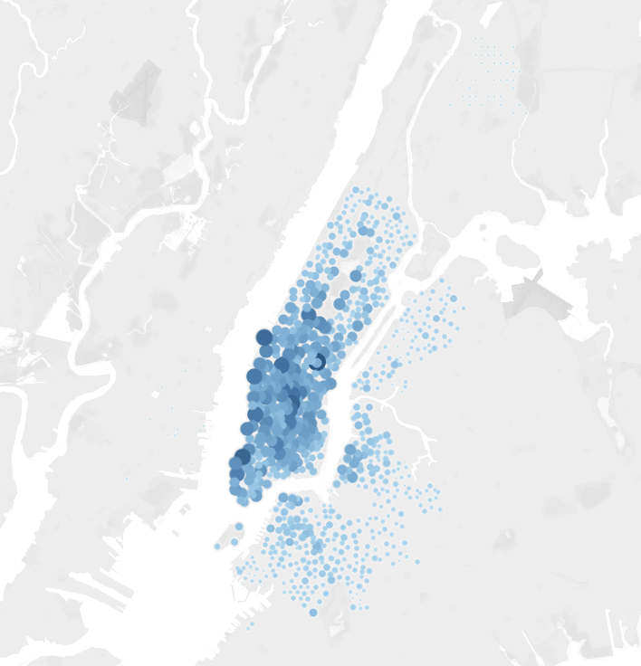
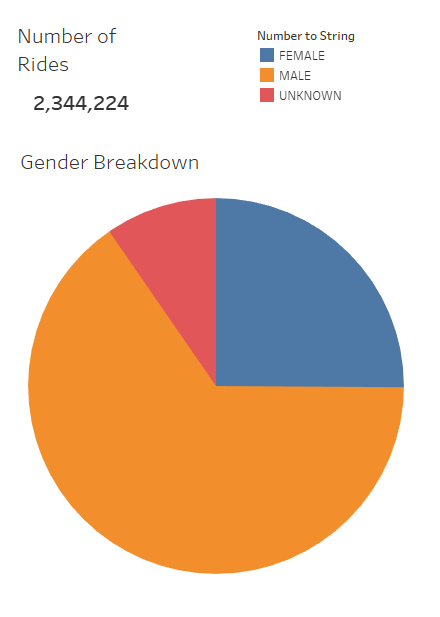
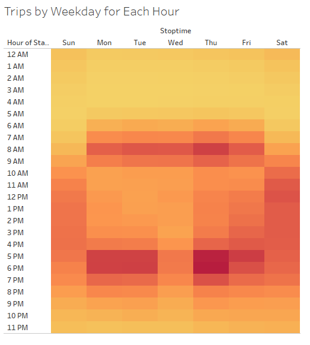
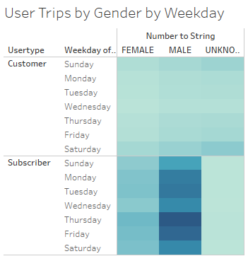

# BikeSharing2

## Overview 

The goal of this analysis is to conduct an analysis on the New York bike sharing data and present the investors the result to convince them that a bike-sharing program in Des Moines is a solid business proposal.

## Results

Riders whose genders are unknown rented their bikes for longer period of time on average.

Most riders rented their bikes for less than 20 minutes.

Most bikers started renting their bikes in the Manhattan Distric

.png)
The "rush hours" for bikers are 6-9 am and 5-8 pm during weekdays. Wedsday afternoon is an exception.

Out of the 2,344,224 riders, majority of them were male riders.

All genders follow similar patterns in terms of the renting time points.

Bike renting subscribers tend to ride bikers more often during weekdays, whereas customers are more likely to rent bikes more often in weekends.
