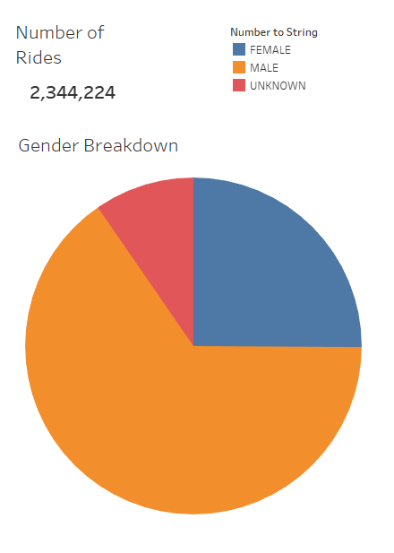
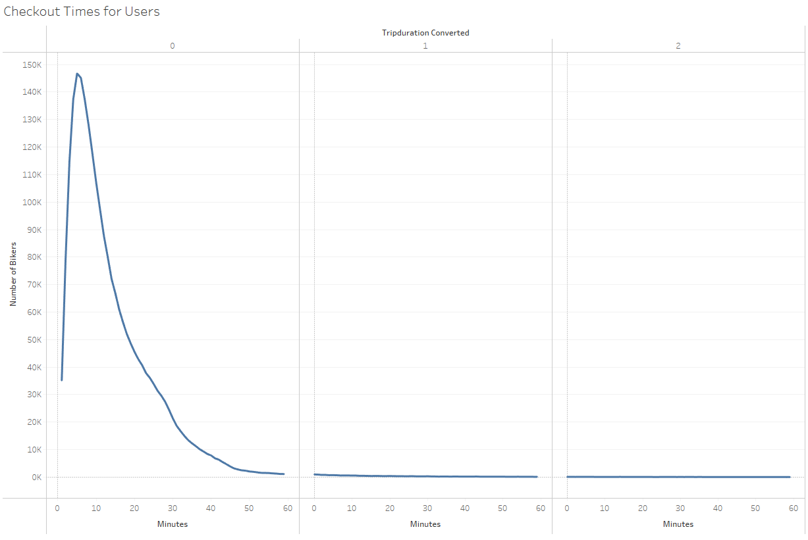
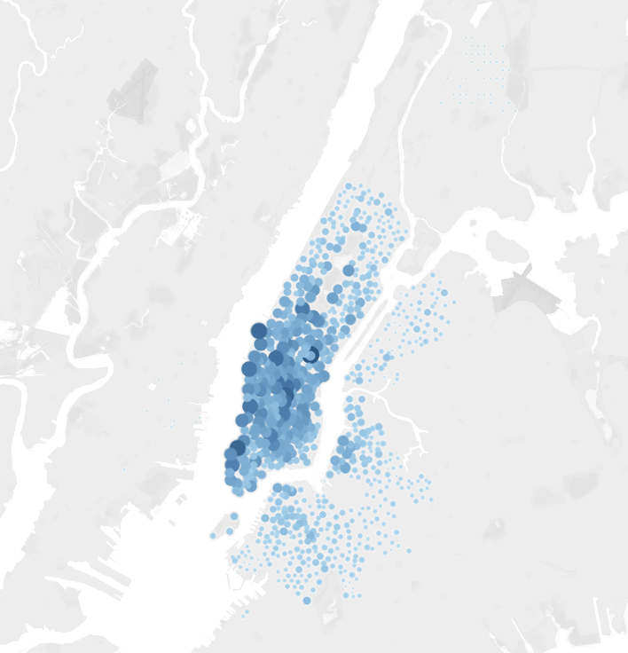
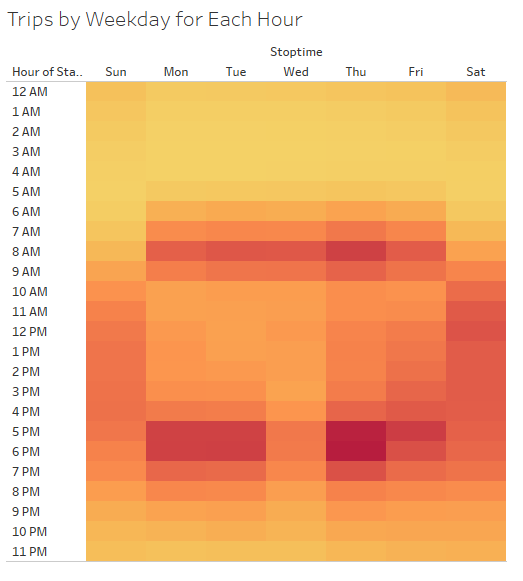
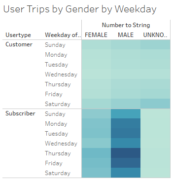

# BikeSharing2

## Overview 

The goal of this analysis is to conduct an analysis on the New York bike sharing data and present the investors the result to convince them that a bike-sharing program in Des Moines is a solid business proposal.

## Results

The results are in the following.

Out of the 2,344,224 riders, majority of them were male riders.

Riders whose genders are unknown rented their bikes for longer period of time on average.

Most riders rented their bikes for less than 20 minutes.

Most bikers started renting their bikes in the Manhattan Distric

.png)

The "rush hours" for bikers are 6-9 am and 5-8 pm during weekdays. Wedsday afternoon is an exception.

All genders follow similar patterns in terms of the renting time points.

Bike renting subscribers tend to ride bikers more often during weekdays, whereas customers are more likely to rent bikes more often in weekends.

Please see the story for the analysis created in Tableau [here](https://public.tableau.com/profile/changsong.yang#!/vizhome/CitiBikeChallenge_16172487475410/Story1?publish=yes)

## Summary

Overall, the rush hours for bike renting are 6-9 am and 5-8 pm during weekdays and the afternoons in weekends. Bike renting subscribers tend to ride bikers more often during weekdays, whereas customers are more likely to rent bikes more often in weekends. Most riders are male. Most people rent bikes in the city downtown. 

Two additional visualizations that could be helpful:

1. A distribution plot that shows the distance of trips using the start and end station coordinates.
2. A heat map that shows the age and gender differences in the users to catch the potential customer groups.
